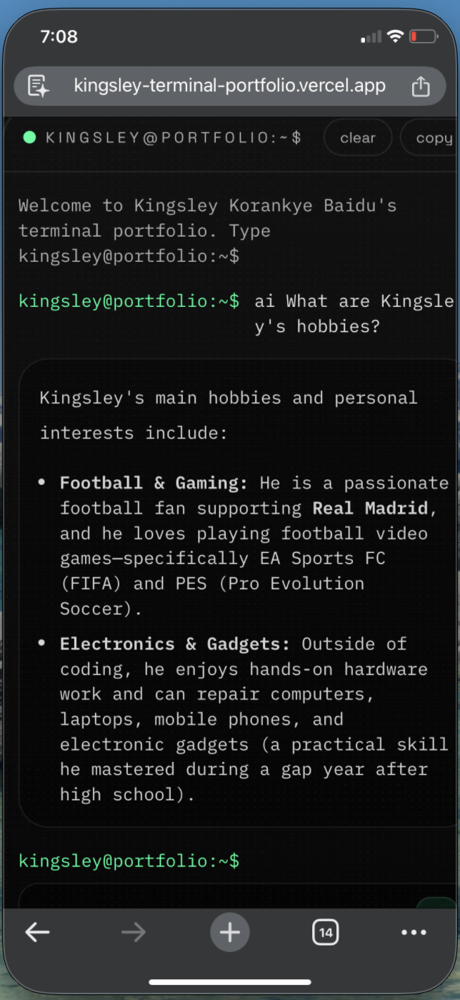

# Kingsley Terminal Portfolio 🚀

> An interactive, AI-powered command-line portfolio built for a Full-Stack, Backend, Cloud, and AI Software Engineer.

[](https://nextjs.org/)
[](https://react.js.org/)
[](https://www.typescriptlang.org/)
[](https://tailwindcss.com/)
[](https://ai.google.dev/)

---

## 📸 Portfolio Preview

<!-- INSERT MAIN TERMINAL SCREENSHOT BELOW -->

> *Placeholder: Insert a screenshot of the main terminal dashboard above (`./docs/screenshots/hero-terminal.png`)*

---

## ✨ Features

- 🖥️ **Interactive Command-Line Interface**: Fully interactive terminal with command history, tab autocomplete, shortcuts, and matrix mode.
- 🤖 **Integrated RAG AI Assistant**: Powered by **Google Gemini 3.6 Flash** and custom RAG retrieval, allowing visitors to ask questions about experience, projects, leadership, and bio.
- 🎨 **Dynamic Color Themes**: Switch themes on the fly (`green`, `blue`, `purple`, `amber`).
- ⚡ **Real-Time Plain Text Streaming**: Instant time-to-first-token streaming for AI responses.
- 📱 **Mobile Responsive**: Custom flex/grid layouts optimized for mobile, tablet, and desktop viewports.
- 📬 **Interactive Contact Form**: Integrated contact terminal with console fallback and Resend email integration.
- 📄 **SEO & Semantic Routing**: Static `/blog` and `/projects` routes alongside terminal navigation.

---

## 📂 Featured Projects Showcase

This section showcases key projects built by Kingsley. Insert your project screenshots into the specified paths in `./docs/screenshots/`.

---

### 1. 🌦️ ClimateHealth Systems
> **Headline:** Multi-platform climate-health early-warning platform (GreenRes Hackathon 2026)

- **Tech Stack:** React Native, Expo, Next.js, FastAPI, TypeScript, Render, Vercel, Open-Meteo, Cloudinary
- **Highlights:** Multi-platform deployment (web, mobile, USSD), live climate data integration, and offline-first storage fallback.
- **Repository:** [github.com/kkbaidu/ClimateHealth](https://github.com/kkbaidu/ClimateHealth)
- **Live Demo:** [climate-health-seven.vercel.app](https://climate-health-seven.vercel.app)

#### 📸 Project Screenshot:
<!-- INSERT CLIMATEHEALTH SCREENSHOT BELOW -->

> *Placeholder: Replace `./docs/screenshots/climate-health.png` with a screenshot of ClimateHealth Systems.*

---

### 2. 📖 Interactive AI Storyteller
> **Headline:** Immersive AI storytelling platform — **3rd Place** COMPSSA x Alle-AI Hackathon (July 2025)

- **Tech Stack:** Next.js 15, React 19, TypeScript, Tailwind CSS v4, Alle-AI API, Framer Motion
- **Highlights:** Orchestrates real-time multi-modal AI generation across text narrative, image scenes, interactive choices, and audio text-to-speech.
- **Repository:** [github.com/kkbaidu/Interactive-AI-Storyteller](https://github.com/kkbaidu/Interactive-AI-Storyteller)
- **Live Demo:** [interactive-ai-storyteller.vercel.app](https://interactive-ai-storyteller.vercel.app/)

#### 📸 Project Screenshot:
<!-- INSERT AI STORYTELLER SCREENSHOT BELOW -->

> *Placeholder: Replace `./docs/screenshots/ai-storyteller.png` with a screenshot of Interactive AI Storyteller.*

---

### 3. 🏡 Radici
> **Headline:** Property listing platform for Ghanaians living abroad (Dext Consortium)

- **Tech Stack:** React, Node.js, Express.js, MongoDB, TypeScript, JWT Auth
- **Highlights:** Full-stack property discovery platform designed for the Ghanaian diaspora with secure role-based access control and responsive property management UI.

#### 📸 Project Screenshot:
<!-- INSERT RADICI SCREENSHOT BELOW -->

> *Placeholder: Replace `./docs/screenshots/radici.png` with a screenshot of Radici.*

---

### 4. 🌐 IP Address Management System (IPAM)
> **Headline:** Production-ready full-stack IP address management platform

- **Tech Stack:** Next.js, Node.js, Express, TypeScript, PostgreSQL, Prisma, Redis, Docker, AWS
- **Highlights:** Calculates next-free IP allocations across CIDR subnets atomically with Redis caching, VLAN management, and audit logging.
- **Repository:** [github.com/kkbaidu/IPAM](https://github.com/kkbaidu/IPAM)
- **Live Demo:** [ipam-five.vercel.app](https://ipam-five.vercel.app/)

#### 📸 Project Screenshot:
<!-- INSERT IPAM SCREENSHOT BELOW -->

> *Placeholder: Replace `./docs/screenshots/ipam.png` with a screenshot of IPAM.*

---

### 5. 📊 Student Result Management System
> **Headline:** Dual-interface (GUI & CLI) student performance analytics application

- **Tech Stack:** Python, CustomTkinter, Matplotlib, PostgreSQL, SHA-256 Auth
- **Highlights:** Features a sleek dark CustomTkinter GUI with Matplotlib charts alongside a headless CLI interface for batch data processing.
- **Repository:** [github.com/kkbaidu/Student-Result-Management-CLI](https://github.com/kkbaidu/Student-Result-Management-CLI)

#### 📸 Project Screenshot:
<!-- INSERT STUDENT RESULT MANAGEMENT SCREENSHOT BELOW -->

> *Placeholder: Replace `./docs/screenshots/student-result.png` with a screenshot of Student Result Management System.*

---

## 🛠️ Additional Portfolio Views

### 📱 Responsive Mobile View
<!-- INSERT MOBILE VIEW SCREENSHOT BELOW -->

> *Placeholder: Replace `./docs/screenshots/mobile-view.png` with a mobile screenshot.*

### 🤖 AI Assistant in Action
<!-- INSERT AI ASSISTANT SCREENSHOT BELOW -->

> *Placeholder: Replace `./docs/screenshots/ai-assistant.png` with a screenshot of `ai <question>`.*

---

## 🕹️ Command Reference

| Command | Description |
| :--- | :--- |
| `about` / `whoami` | Displays Kingsley's background story, role, and focus areas |
| `projects` / `project <slug>` | Lists all pinned projects or details for a specific project |
| `skills` / `stack` | Displays technical skills categorized with proficiency bars |
| `experience` | Work history timeline (Tradelio, Dext, Backslash, Polymorph, OGames) |
| `hackathons` | Shows hackathon awards and projects (GreenRes 2026, Alle-AI 3rd Place) |
| `leadership` | Leadership roles and achievements |
| `hobbies` | Personal interests, gaming (FIFA/FC), football (Real Madrid), electronics |
| `ai <question>` | Ask the AI assistant anything about Kingsley's experience or background |
| `contact` / `hire` | Opens the interactive contact terminal form |
| `github` | Live GitHub stats and latest repositories snapshot |
| `resume` | Previews resume details and download link |
| `theme <color>` | Switch terminal theme (`green`, `blue`, `purple`, `amber`) |
| `matrix` | Toggles animated matrix overlay |
| `clear` | Clears terminal history |

---

## 💻 Tech Stack

- **Framework**: Next.js 16 (App Router, Turbopack)
- **Language**: TypeScript
- **UI & Styling**: Tailwind CSS v4, Glassmorphism, Custom CSS Variables
- **Animations**: Framer Motion
- **AI Integration**: Vercel AI SDK (`ai`), `@ai-sdk/google`, Google Gemini 3.6 Flash
- **Form Handling**: React Hook Form, Zod Validation
- **Email Service**: Resend API
- **Icons**: Lucide React

---

## 🚀 Getting Started

### 1. Clone & Install Dependencies
```bash
git clone https://github.com/kkbaidu/New-Kings-Terminal-Portfolio.git
cd New-Kings-Terminal-Portfolio
npm install
```

### 2. Configure Environment Variables
Create a `.env.local` file in the root directory:

```env
# Google Gemini API Configuration
GEMINI_API_KEY=your_gemini_api_key_here
GEMINI_MODEL=gemini-3.6-flash

# Contact Form Delivery (Optional)
RESEND_API_KEY=your_resend_api_key_here
CONTACT_TO_EMAIL=kingsleybaidu99@gmail.com
CONTACT_FROM_EMAIL=Portfolio <onboarding@resend.dev>

# Optional OpenAI fallback
OPENAI_API_KEY=
```

### 3. Run Development Server
```bash
npm run dev
```
Open `http://localhost:3000` in your browser.

---

## 📦 Building for Production

```bash
npm run build
npm run start
```

---

## 👤 Author

**Kingsley Korankye Baidu**
- **Role**: Software Engineer (Full-Stack, Cloud, Mobile, AI)
- **Location**: Accra, Ghana
- **GitHub**: [@kkbaidu](https://github.com/kkbaidu)
- **LinkedIn**: [kingsley-korankye-baidu](https://www.linkedin.com/in/kingsley-korankye-baidu)
- **Email**: [kingsleybaidu99@gmail.com](mailto:kingsleybaidu99@gmail.com)
