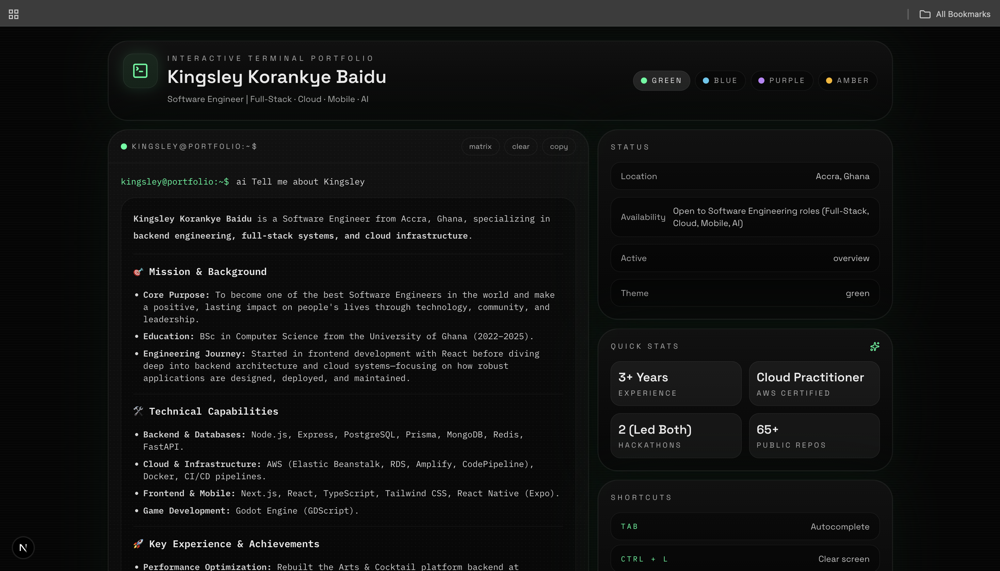

# Kingsley Terminal Portfolio 🚀

> An interactive, AI-powered command-line portfolio built for a Full-Stack, Backend, Cloud, and AI Software Engineer.

[](https://nextjs.org/)
[](https://react.js.org/)
[](https://www.typescriptlang.org/)
[](https://tailwindcss.com/)
[](https://ai.google.dev/)

---

## 📸 Portfolio Screenshots (2 Main Views)

### 1. 🖥️ Interactive Terminal & AI Assistant
<!-- SCREENSHOT 1 OF 2 -->

> *Placeholder: Add screenshot #1 here (`./docs/screenshots/terminal-ai.png`)*

---

### 2. 📱 Projects & Mobile View
<!-- SCREENSHOT 2 OF 2 -->

> *Placeholder: Add screenshot #2 here (`./docs/screenshots/projects-mobile.png`)*

---

## ✨ Key Features

- 🖥️ **Interactive Command-Line Interface**: Custom terminal with command history, tab autocomplete, shortcuts, and matrix mode.
- 🤖 **RAG AI Assistant**: Powered by **Google Gemini 3.6 Flash** and custom RAG retrieval.
- 🎨 **Dynamic Color Themes**: Switch themes on the fly (`green`, `blue`, `purple`, `amber`).
- ⚡ **Real-Time Plain Text Streaming**: Instant time-to-first-token response generation.
- 📱 **Mobile Responsive Layout**: Optimized across mobile, tablet, and desktop viewports.
- 📬 **Interactive Contact Terminal**: Direct client contact form with console fallback and Resend delivery support.

---

## 📂 Featured Projects Overview

- **ClimateHealth Systems** *(GreenRes Hackathon 2026)* — Multi-platform climate-health early-warning system (React Native, Next.js, FastAPI, Render, Vercel).
- **Interactive AI Storyteller** *(3rd Place COMPSSA x Alle-AI Hackathon)* — Immersive AI storytelling platform (Next.js 15, React 19, Alle-AI API).
- **Radici** *(Dext Consortium)* — Property listing platform for the Ghanaian diaspora (React, Node.js, Express, MongoDB).
- **IPAM - IP Address Management System** — Full-stack IP address management platform (Next.js, Express, PostgreSQL, Prisma, Redis, Docker, AWS).
- **Student Result Management System** — Dual-interface (GUI & CLI) student performance analytics app (Python, CustomTkinter, Matplotlib, PostgreSQL).

---

## 🕹️ Command Catalog

| Command | Description |
| :--- | :--- |
| `about` / `whoami` | Displays Kingsley's background story, role, and focus areas |
| `projects` / `project <slug>` | Lists all pinned projects or details for a specific project |
| `skills` / `stack` | Displays technical skills categorized with proficiency bars |
| `experience` | Work history timeline (Tradelio, Dext, Backslash, Polymorph, OGames) |
| `hackathons` | Shows hackathon awards and projects (GreenRes 2026, Alle-AI 3rd Place) |
| `leadership` | Leadership roles and achievements |
| `hobbies` | Personal interests, gaming (FIFA/FC), football (Real Madrid), electronics |
| `ai <question>` | Ask the AI assistant anything about Kingsley's experience or background |
| `contact` / `hire` | Opens the interactive contact terminal form |
| `github` | Live GitHub stats and latest repositories snapshot |
| `resume` | Previews resume details and download link |
| `theme <color>` | Switch terminal theme (`green`, `blue`, `purple`, `amber`) |
| `matrix` | Toggles animated matrix overlay |
| `clear` | Clears terminal history |

---

## 💻 Tech Stack

- **Framework**: Next.js 16 (App Router, Turbopack)
- **Language**: TypeScript
- **UI & Styling**: Tailwind CSS v4, Glassmorphism, Custom CSS Variables
- **Animations**: Framer Motion
- **AI Integration**: Vercel AI SDK (`ai`), `@ai-sdk/google`, Google Gemini 3.6 Flash
- **Form Handling**: React Hook Form, Zod Validation
- **Email Service**: Resend API
- **Icons**: Lucide React

---

## 🚀 Quick Setup

```bash
# 1. Install dependencies
npm install

# 2. Configure .env.local
GEMINI_API_KEY=your_gemini_api_key_here
GEMINI_MODEL=gemini-3.6-flash
CONTACT_TO_EMAIL=kingsleybaidu99@gmail.com

# 3. Start development server
npm run dev
```

---

## 👤 Author

**Kingsley Korankye Baidu**
- **Role**: Software Engineer (Full-Stack, Cloud, Mobile, AI)
- **Location**: Accra, Ghana
- **GitHub**: [@kkbaidu](https://github.com/kkbaidu)
- **LinkedIn**: [kingsley-korankye-baidu](https://www.linkedin.com/in/kingsley-korankye-baidu)
- **Email**: [kingsleybaidu99@gmail.com](mailto:kingsleybaidu99@gmail.com)
